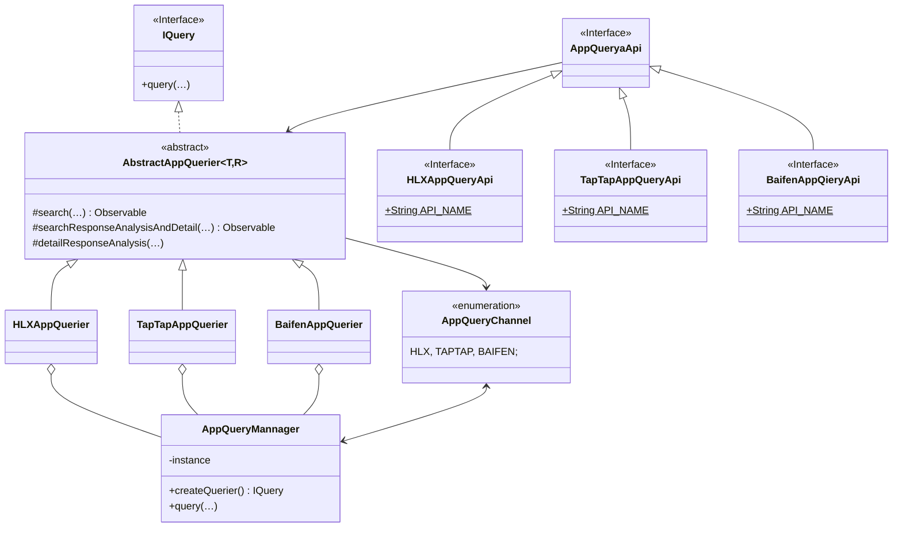
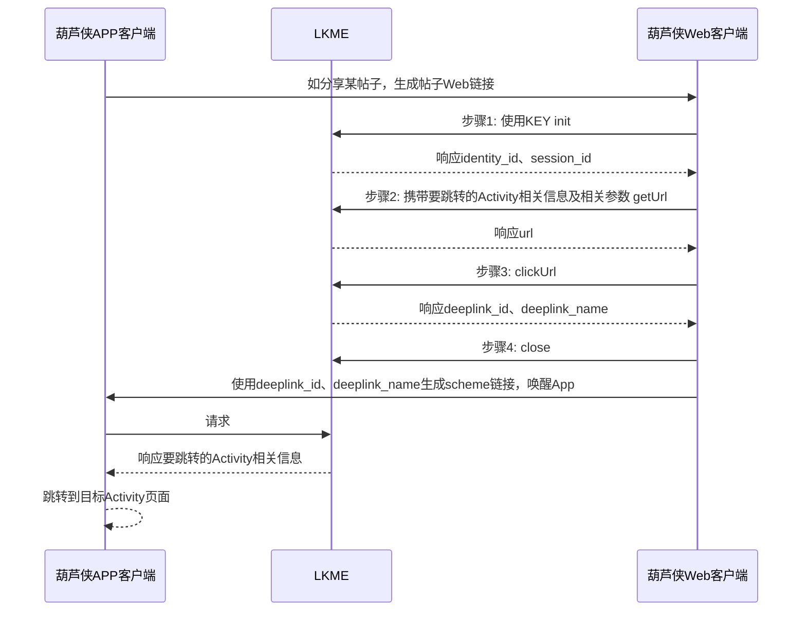

# README

### 原创助手APP

> fun.qianxiao.originalassistant

原创助手App全新版本。
用于原创技术成员/测试人员发帖使用，选择App一键复制帖子内容/测试结果。支持多渠道获取应用信息、一键翻译游戏介绍，更支持一键发帖等功能，更多好用功能能你来发现。
当前已支持Android 11、12、13，提供更好的功能，更好的服务。
项目已开源，如有兴趣欢迎共同维护。

### 应用信息查询器/接口

针对应用查询模块（AppQuery），使用`retrofit`+`rxjava`+`okhttp`框架，结合Java泛型、反射等特性已进行高度抽象和封装，可根据该章节说明进行更多查询器（AppQuerier）开发。

##### 模块类图



##### 架构说明

`AppQueryMannager`为App信息查询管理单例类，可通过该类创建某渠道查询器的查询接口IQuery。

`AbstractAppQuerier`为查询器抽象父类，实现了IQuery接口，抽象了信息查询过程。泛型接收`retrofit`请求接口，并创建接口实例。当前额外封装了泛型参数2，支持传入响应对象格式，当前支持`JSONObject`、`okhttp3.ResponseBody`

`AppQueryaApi`接口仅为标记接口，用于泛型接受该接口的子接口类型。用于定于`retrofit`请求接口。

`AppQueryChannel`枚举了各查询渠道定义，封装了渠道名称图标和子查询器（`Class<? extends AbstractAppQuerier<?, ?>>`），用于自动管理多渠道查询器，如自动（All）查询方式。

每个渠道查询器，继承`AbstractAppQuerier`，并传入`retrofit`请求接口（`T extends AppQueryaApi`），由`AbstractAppQuerier`自动创建`retrofit`请求接口实例，实现`AbstractAppQuerier`抽象的过程方法。

##### 使用示例

创建单渠道查询接口示例并查询

```java
AppQueryMannager.createQuerier(TapTapAppQuerier.class).query("应用名", "应用包名", new IQuery.OnAppQueryListener() {
    @Override
    public void onResult(int code, String message, AppQueryResult appQueryResult) {
        
    }
});
```

自动（All）查询，即遍历当前全部查询渠道，直到查询成功

```java
AppQueryMannager.getInstance().query("应用名", "应用包名", new IQuery.OnAppQueryListener() {
    @Override
    public void onResult(int code, String message, AppQueryResult appQueryResult) {

    }
});
```

##### 创建新的查询器

1. 继承`AppQueryaApi`接口，创建渠道`retrofit`请求接口定义。
2. 继承`AbstractAppQuerier`抽象类，泛型传入渠道`retrofit`请求接口（`? extends AppQueryaApi`）和响应对象格式（`JSONObject`或`okhttp3.ResponseBody`），创建XX渠道查询器。并实现抽象的查询过程方法。
3. 在`AppQueryMannager.AppQueryChannel`中创建渠道枚举定义，传入渠道名称图标及渠道查询器（`Class<? extends AbstractAppQuerier<?, ?>>`）。


### 深度链接跳转接入

葫芦侠App（含三楼）目前已接入了深度链接（lkme.cc），支持跳转帖子详情页、活动详情页、应用详情页等。当在App分享某页面时葫芦侠App会生成网页链接，浏览器访问该网页，点击葫芦侠打开按钮，会直接跳转葫芦侠APP相关页面。通过抓包并分析了其原理，并在原创助手中模拟请求，实现跳转葫芦侠相关页面的功能（如跳转到指定帖子详情页面等）。

##### 原理

前提：葫芦侠事先在lkme注册应用，获得lkme分发的KEY。App客户端和Web客户端均携带KEY。



##### 原创助手接入

[OriginalAssistant/HLXLinkedMeManager.java at master · qx0657/OriginalAssistant · GitHub](https://github.com/qx0657/OriginalAssistant/blob/master/app/src/main/java/fun/qianxiao/originalassistant/manager/HLXLinkedMeManager.java)

其主要模拟请求Web端与LKME的4次交互（如上图），获取最终的关键信息字段deeplink_id、deeplink_name，即可拼装生成android scheme跳转链接。

```html
hlx.floor://linkedme?lkme=1&r={timestamp_ms}&uid={deeplink_id}&click_id={deeplink_name}
```

支持跳转的葫芦侠App Activity页面及参数可反编译葫芦侠App查看`com.huluxia.ui.home.linkedme.MiddleActivity`类。

LKME跳转Activity信息封装：

```json
{
    "JumpActivity": "XXActivity",
    "TopicID": "45344479",
    "isVideo": "0"
}
```


##### 支持跳转的Activity

* TopicDetailActivity

  > 帖子详情页面

  LKME跳转Activity信息封装格式：

  ```json
  {
      "JumpActivity": "TopicDetailActivity",
      "ExtendedParameterName": "ExtendedParameterValue",
      ……
  }
  ```

* ActionDetailActivity

  > 活动详情页面

  LKME跳转Activity信息封装：

  ```json
  {
      "JumpActivity": "ActionDetailActivity",
      "ActionID": "417",
      "extraInfo": ""
  }
  ```

* ResourceCuzActivity

  > 应用详情页面

  LKME跳转Activity信息封装：

  ```json
  {
      "JumpActivity": "ResourceCuzActivity",
      "GameID": "88772",
      "From": ""
  }
  ```

* ResourceTopicDetailActivity

  > 应用专题详情页面

  LKME跳转Activity信息封装：

  ```json
  {
      "JumpActivity": "ResourceTopicDetailActivity",
      "TOPIC_ID": "985",
      "TOPIC_TITLE": "",
      "TOPIC_TYPE": ""
  }
  ```


### 更多内容

陆续更新中
